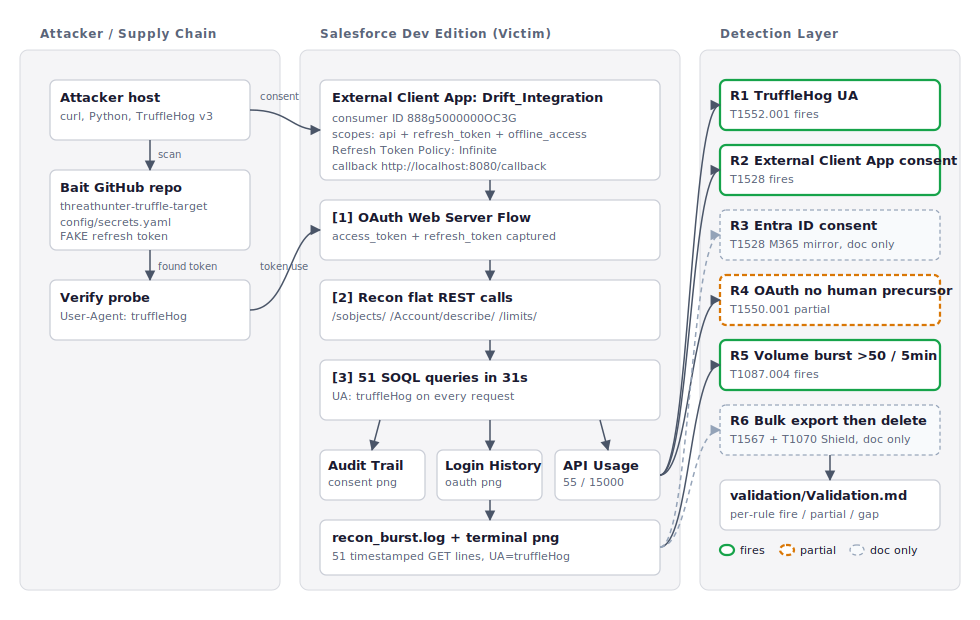

# UNC6395 / Salesloft Drift Detection Package

A weekend detection-engineering deliverable covering the Salesloft Drift OAuth supply-chain compromise of August 2025. Includes a threat profile, an MITRE ATT&CK matrix, a reproducible lab emulation against a Salesforce Developer Edition tenant, six Sigma rules with three KQL translations, and a per-rule validation pass with honest gaps.

---

## Threat Profile in One Paragraph

Between March and August 2025, a financially motivated actor tracked as **UNC6395** (Mandiant), **GRUB1** (Cloudflare), and publicly claimed by ShinyHunters compromised the Salesloft Drift application and used its OAuth integration to mass-exfiltrate Salesforce data from approximately 700 downstream customer tenants including Cloudflare. The actor obtained access to Salesloft's GitHub repositories between March and June 2025, extracted OAuth refresh tokens for the Drift Salesforce integration from Salesloft's AWS environment (Secrets Manager / SSM Parameter Store), then operated against victim Salesforce tenants from August 8 to August 20 by reusing those tokens as valid app credentials. Recon followed a "schema-then-bulk" pattern (object enumeration, COUNT probes, schema describes) before pivoting to Salesforce Bulk API 2.0 jobs for export, with immediate job deletion as anti-forensics and Tor exit nodes for egress. Stolen records were mined offline with TruffleHog for embedded secrets (AWS access keys, Snowflake credentials, passwords, SSO/VPN URLs) to enable downstream compromise. Salesloft revoked all Drift OAuth and refresh tokens and removed Drift from the Salesforce AppExchange on August 20, 2025.

Full profile, IOCs, and timeline: [`profile/README.md`](profile/README.md).

---

## Scope and Limitations

**In scope.** Reproducible emulation of four MITRE ATT&CK techniques against an owned Salesforce Developer Edition tenant: T1552.001 (credentials in files, GitHub + TruffleHog), T1528 (steal application access token, OAuth Web Server Flow against an External Client App), T1550.001 (use alternate auth material, token replay against `/services/data` REST endpoints), and T1087.004 (cloud account discovery, schema-then-bulk SOQL recon). Six Sigma rules covering eight techniques across the kill chain, with KQL translations of the three rules whose data sources live in Microsoft Sentinel.

**Out of scope.** Breaching real third-party SaaS vendors. The Drift-equivalent External Client App in this lab is `Drift_Integration` and lives entirely in a self-owned Salesforce Developer Edition org. No real Salesloft, Salesforce customer, or Microsoft tenant data is involved.

**Free-tier substitutions.** Salesforce Developer Edition does not include Shield / Event Monitoring. The lab uses Setup Audit Trail, Login History, and the System Overview API Usage tile as honest free-tier proxies. Sigma and KQL rules cite the production Event Monitoring fields explicitly so the detection design is preserved. The Microsoft 365 mirror was scoped but not built; R3 (Entra ID consent grant detection) is documented and KQL-translated but not validated against captured artifacts.

---

## Lab Architecture



Three swimlanes left to right: attacker / supply chain (TruffleHog scan against an owned bait repo, then a verification probe with `User-Agent: truffleHog`), Salesforce Developer Edition victim tenant (External Client App `Drift_Integration` with `Refresh Token Policy = Infinite`, OAuth Web Server Flow, recon flat REST calls, and a 51-query SOQL burst), and the detection layer (six Sigma rules feeding the validation file). Solid green borders are rules that fire on captured artifacts (R1, R2, R5), amber dashed is partial (R4), gray dashed is documented but not fired (R3 needs the M365 mirror, R6 needs Salesforce Shield).

Diagram source: [`lab/architecture.svg`](lab/architecture.svg).

---

## TTP Matrix

Ten ATT&CK techniques, six lab-fired or lab-validated, four documented from primary sources. Detection rule column references the Sigma rule ID. Full matrix with per-technique evidence: [`matrix/README.md`](matrix/README.md). MITRE Navigator layer: [`matrix/UNC6395-layer.json`](matrix/UNC6395-layer.json), [`matrix/UNC6395-layer.svg`](matrix/UNC6395-layer.svg).

| # | ATT&CK ID | Technique | Tactic | Plan | Detection |
|---|---|---|---|---|---|
| 1 | [T1195.002](https://attack.mitre.org/techniques/T1195/002/) | Supply Chain Compromise: Software Supply Chain | Initial Access | Document | (none) |
| 2 | [T1199](https://attack.mitre.org/techniques/T1199/) | Trusted Relationship | Initial Access | Document | (none) |
| 3 | [T1552.001](https://attack.mitre.org/techniques/T1552/001/) | Unsecured Credentials: Credentials In Files | Credential Access | **Emulate** | R1 |
| 4 | [T1528](https://attack.mitre.org/techniques/T1528/) | Steal Application Access Token | Credential Access | **Emulate** | R2 (Salesforce), R3 (M365 mirror) |
| 5 | [T1078.004](https://attack.mitre.org/techniques/T1078/004/) | Valid Accounts: Cloud Accounts | Defense Evasion | Document | R4 (secondary) |
| 6 | [T1550.001](https://attack.mitre.org/techniques/T1550/001/) | Use Alternate Auth Material: App Access Token | Lateral Movement | **Emulate** | R4 |
| 7 | [T1087.004](https://attack.mitre.org/techniques/T1087/004/) | Account Discovery: Cloud Account | Discovery | **Emulate** | R5 |
| 8 | [T1213.006](https://attack.mitre.org/techniques/T1213/006/) | Data from Information Repositories: Databases | Collection | Document | R5 + R6 |
| 9 | [T1567](https://attack.mitre.org/techniques/T1567/) | Exfiltration Over Web Service | Exfiltration | Document | R6 |
| 10 | [T1070](https://attack.mitre.org/techniques/T1070/) | Indicator Removal | Defense Evasion | Document | R6 |

---

## Detection Package

Six Sigma rules, three KQL translations. Sigma sources of truth in [`detections/sigma/`](detections/sigma/), KQL in [`detections/kql/`](detections/kql/), per-rule validation in [`validation/Validation.md`](validation/Validation.md).

| Rule | ATT&CK | Hypothesis | File | Validation Status |
|---|---|---|---|---|
| **R1** | T1552.001 | An attacker is verifying credentials harvested from leaked source by issuing requests with `User-Agent: truffleHog` | [Sigma](detections/sigma/R1_T1552.001_trufflehog_user_agent.yml) | **FIRES** on `emulation/salesforce/output/recon_burst.log` (51 lines) |
| **R2** | T1528 | A newly created Salesforce External Client App requests `api` plus `refresh_token` plus `offline_access` scopes, often with an Infinite refresh token policy | [Sigma](detections/sigma/R2_T1528_salesforce_oauth_consent.yml) | **FIRES** on `emulation/salesforce/output/consent_audit_trail.png` (10:28:40 PDT row) |
| **R3** | T1528 | A Microsoft Entra ID consent grant for an OAuth app requesting high-privilege Graph scopes | [Sigma](detections/sigma/R3_T1528_m365_oauth_consent.yml) + [KQL](detections/kql/R3_T1528_m365_oauth_consent.kql) | NOT FIRED (M365 mirror not built; rule structurally validated against Microsoft's published consent-phishing detection guidance) |
| **R4** | T1550.001 | An OAuth application sign-in occurs with no preceding interactive sign-in for the same `AppId` in the prior 24 hours | [Sigma](detections/sigma/R4_T1550.001_oauth_signin_no_human_precursor.yml) + [KQL](detections/kql/R4_T1550.001_serviceprincipal_no_human.kql) | PARTIAL (rule logic correct, lab user has interactive sign-in inside the 24h window; production case is dormant tokens consented months earlier) |
| **R5** | T1087.004 | More than 50 cloud-account or sObject enumeration calls from a single OAuth app within a 5-minute window | [Sigma](detections/sigma/R5_T1087.004_volume_enumeration.yml) + [KQL](detections/kql/R5_T1087.004_volume_enumeration.kql) | **FIRES** on `emulation/salesforce/output/recon_burst.log` (51 in 31 seconds) and `system_overview_api_usage.png` (55-call delta) |
| **R6** | T1567 + T1070 | A Salesforce Bulk API job is created and deleted by the same Connected App within 30 minutes | [Sigma](detections/sigma/R6_T1567_T1070_bulk_export_then_delete.yml) | NOT FIRED (Developer Edition lacks Event Monitoring; rule documented against Cloudflare timeline at 2025-08-17 11:11:56 to 11:15:42 UTC) |

**Headline:** three rules fire cleanly on captured artifacts (R1, R2, R5), one fires partially (R4), two are documented but not fired (R3 needs M365 mirror, R6 needs Salesforce Shield).

---

## Validation Results

Full per-rule validation: [`validation/Validation.md`](validation/Validation.md).

For each rule that fires, the validation file walks through the captured evidence artifact, the timestamps, and the latency between attacker action and detection. For each rule that does not fire, the file documents what log source is missing, what would be required to fire it cleanly, and whether the rule logic itself is sound.

The two strongest assets in this package:

1. **R1 (TruffleHog User-Agent)** is the most defensible single rule because the IOC is a literal string named in the GTIG advisory, the detection is a one-line `contains` match, and the lab reproduces it end-to-end. The Sigma rule is approximately 30 lines including metadata and false-positive notes.
2. **R2 (External Client App + Infinite refresh token policy)** is the second most defensible because the lab External Client App was deliberately configured to mirror Drift's actual posture (`api` + `refresh_token` + `offline_access` scopes, Refresh Token Policy = Infinite). The Setup Audit Trail row at 10:28:40 PDT showing the policy change is the lab artifact that ties the emulation to the real Drift configuration that made the campaign possible.

---

## What I Would Do with More Time

The most important section of this README. What was deliberately cut, in priority order:

1. **Build the M365 Developer Program mirror.** Fires R3 cleanly against captured `AuditLogs`, validates the cross-platform translation thesis (same OAuth consent abuse pattern, different SaaS). Estimated effort: 90 minutes for tenant + Entra ID app registration + one consent grant + KQL validation in Sentinel. Was scoped for Sunday 09:00 to 10:30 PDT in the original roadmap; the block was reallocated to detection rule authoring after Salesforce-side emulation ran longer than estimated.

2. **Acquire a Salesforce Shield trial.** The lab uses Setup Audit Trail, Login History, and System Overview API Usage as honest free-tier proxies for Salesforce Event Monitoring. R2, R5, R6 are field-mapped to Event Monitoring schemas (`EventLogFile` event types `RestApi`, `ConnectedApplication`, `BulkApi2`). Activating them against real Event Monitoring records is a logsource swap, not a rule rewrite.

3. **Layer SSPM coverage at the consent layer.** AppOmni or Defender for Cloud Apps would catch malicious External Client Apps at consent time rather than after enumeration. Worth pairing with R2 + R3 to shift detection left.

4. **Build the Tor / DigitalOcean ASN deviation rule.** Ingest the Tor exit node IP list from `profile/README.md` section 11 as a Microsoft Sentinel watchlist; join against `SigninLogs` and Salesforce LoginHistory to catch the AWS-to-DigitalOcean-to-Tor pivot the actual UNC6395 actor used during exfiltration. This is the cleanest single behavioral signal in the entire campaign because the legitimate Salesloft baseline lived inside AWS IP space.

5. **Build a downstream-blast-radius hunt.** When a partner SaaS vendor discloses an OAuth token compromise, automatically pivot every Connected App or External Client App sign-in from that vendor's `AppId` into a hunting queue. This converts a vendor disclosure into a defender action item in minutes rather than weeks.

6. **Measure FP rates per rule.** Replay 30 days of synthetic baseline traffic through the lab and count alert volume. Without this, the `level` field on each Sigma rule is a best-estimate rather than a measured quantity. Promote to `high` only what survives baseline.

7. **Translate R1, R2, R6 to KQL.** Currently only R3, R4, R5 have KQL translations because they target Microsoft data sources native to Sentinel. If the package needs to ingest Salesforce Event Monitoring into Sentinel (via the Salesforce data connector or a custom Logic App), R1, R2, R6 would gain KQL translations.

8. **Write SPL and Elastic translations.** Sigma is the source of truth; SPL and Elastic translations would broaden the deliverable's portability story without changing the underlying detection design.

---

## Repo Structure

```
.
├── README.md                              this file
├── profile/
│   └── README.md                          full UNC6395 threat profile, IOCs, timeline
├── matrix/
│   ├── README.md                          ten-technique TTP matrix with per-technique evidence
│   ├── UNC6395-layer.json                 MITRE ATT&CK Navigator layer
│   └── UNC6395-layer.svg                  Navigator export
├── lab/
│   └── architecture.svg                   lab architecture diagram (3 swimlanes, status-coded rules)
├── emulation/
│   ├── github/                            T1552.001 emulation, TruffleHog scan + verification probe
│   │   ├── README.md
│   │   ├── bait/                          private repo mirror with planted fake refresh token
│   │   ├── scripts/                       TruffleHog scan + truffleHog User-Agent verifier
│   │   └── output/                        truffle.json, screenshots, verify_request.log
│   ├── salesforce/                        T1528 + T1550.001 + T1087.004 emulation
│   │   ├── README.md
│   │   ├── keys/                          External Client App consumer_key + secret (gitignored tokens)
│   │   ├── scripts/                       OAuth flow + token refresh + recon burst (UA=truffleHog)
│   │   └── output/                        recon_burst.log, sobjects/describe/limits JSON, four PNGs
│   └── m365/                              Microsoft 365 mirror (scoped, not built)
├── detections/
│   ├── sigma/
│   │   ├── README.md                      rule index, validation status, gaps
│   │   ├── R1_T1552.001_trufflehog_user_agent.yml
│   │   ├── R2_T1528_salesforce_oauth_consent.yml
│   │   ├── R3_T1528_m365_oauth_consent.yml
│   │   ├── R4_T1550.001_oauth_signin_no_human_precursor.yml
│   │   ├── R5_T1087.004_volume_enumeration.yml
│   │   └── R6_T1567_T1070_bulk_export_then_delete.yml
│   └── kql/
│       ├── README.md                      KQL translation rationale and scope
│       ├── R3_T1528_m365_oauth_consent.kql
│       ├── R4_T1550.001_serviceprincipal_no_human.kql
│       └── R5_T1087.004_volume_enumeration.kql
└── validation/
    └── 06 Validation.md                   per-rule validation pass with honest gaps
```

---

## Source Library

Primary reporting:

- **Google Threat Intelligence Group**, "Widespread Data Theft Targets Salesforce Instances via Salesloft Drift," August 2025. [cloud.google.com](https://cloud.google.com/blog/topics/threat-intelligence/data-theft-salesforce-instances-via-salesloft-drift)
- **Cloudflare**, "The impact of the Salesloft Drift breach on Cloudflare and our customers," August 2025 (best public victim-side timeline). [blog.cloudflare.com](https://blog.cloudflare.com/response-to-salesloft-drift-incident/)
- **Permiso Security**, "Anatomy of the Salesloft Breach: Detection, Response, and Lessons Learned," 2025. [permiso.io](https://permiso.io/blog/anatomy-of-the-salesloft-breach)

Vendor synthesis and SaaS security perspective:

- Anomali, "Reviewing the Salesforce-Salesloft Drift OAuth Supply Chain Breach"
- AppOmni, "Drift Breach Salesforce UNC6395"
- Mitiga, "ShinyHunters and UNC6395: Inside the Salesforce and Salesloft Breaches"
- Astrix Security, "UNC6395 OAuth compromise spanning Salesforce, Google Workspace, AWS"
- Arctic Wolf, "Widespread Salesforce Data Theft via Compromised Salesloft Drift OAuth Tokens"

Reference documentation:

- MITRE ATT&CK techniques: T1195.002, T1199, T1528, T1550.001, T1087.004, T1213.006, T1567, T1070, T1552.001, T1078.004
- Salesforce Help, "OAuth 2.0 Web Server Flow for Web App Integration"
- Salesforce Help, "External Client Apps Overview" (Spring 2024 release)
- Salesforce Trust documentation on Event Monitoring (R2, R5, R6 production targeting)
- TruffleHog v3 GitHub repository (`trufflesecurity/trufflehog`, default User-Agent reference)
- Microsoft Graph documentation: Delegated permissions and consent (M365 mirror reference)
- Microsoft Defender for Cloud Apps, "Investigate Risky OAuth Apps"
- Microsoft Entra ID, "Protect Against Consent Phishing"

---

**Author:** Zachariah Hansel
**Last updated:** 2026-04-26
