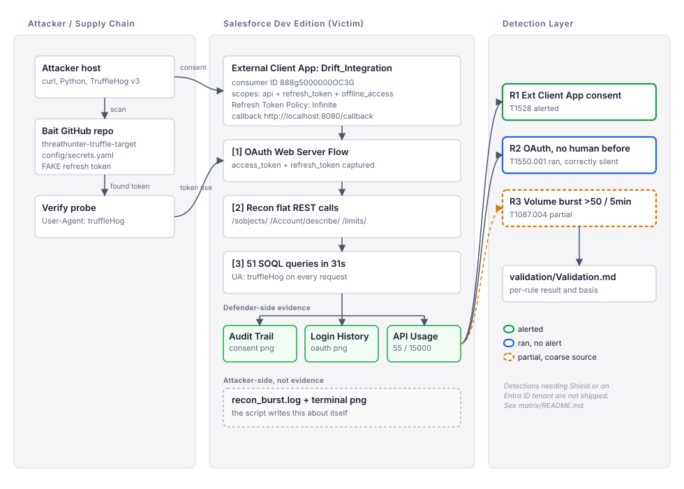

# UNC6395 / Salesloft Drift Emulation and Hunt

## 1. Threat Profile

| Field | Value |
|---|---|
| Actor | UNC6395 (Mandiant), GRUB1 (Cloudflare), claimed by ShinyHunters |
| Campaign window | March to August 2025 |
| Upstream access | Salesloft GitHub repositories, March to June 2025 |
| Token source | Salesloft AWS, Secrets Manager and SSM Parameter Store |
| Victim-side activity | August 8 to August 20, 2025 |
| Exfiltration | Salesforce Bulk API 2.0, egress via Tor |
| Containment | Drift tokens revoked, app pulled from AppExchange, 2025-08-20 |

The actor used Drift's OAuth integration to mass-exfiltrate Salesforce data from downstream tenants, Cloudflare among them.
Stolen tokens were replayed as valid app credentials.

Recon followed a schema-then-bulk pattern: object enumeration, COUNT probes, schema describes.
Export jobs were deleted immediately as anti-forensics.
Stolen records were mined offline with TruffleHog for AWS keys, Snowflake credentials, passwords and SSO URLs.

Full profile, IOCs and timeline: [`profile/README.md`](profile/README.md).

---

## 2. Scope

### In Scope

Four MITRE ATT&CK techniques emulated against an owned Salesforce Developer Edition tenant.

| Technique | Emulated as |
|---|---|
| T1552.001 | Credentials in files, via GitHub and TruffleHog |
| T1528 | Steal application access token, OAuth Web Server Flow against an External Client App |
| T1550.001 | Use alternate auth material, token replay against `/services/data` |
| T1087.004 | Cloud account discovery, schema-then-bulk SOQL recon |

Three Sigma rules ship with the package.
Each targets a log source this tenant produces, so each returned a result.

### Out of Scope

Breaching real third-party SaaS vendors.
The Drift stand-in is `Drift_Integration` and lives entirely in a self-owned org.
No real Salesloft, Salesforce customer or Microsoft tenant data is involved.

Detections that would need Salesforce Shield or an Entra ID tenant are not shipped.
Writing rules against log sources this lab cannot produce would mean publishing detections nobody here has run.
The techniques those rules would cover are still documented in [`matrix/README.md`](matrix/README.md), with the detection column marked accordingly.

### Free-Tier Substitutions

Developer Edition has no Shield or Event Monitoring. The proxies are uneven.

| Production source | Lab substitute | Quality |
|---|---|---|
| `ConnectedApplication` | Setup Audit Trail | Genuine replacement |
| `LoginEvent.LoginType` | Login History | Genuine replacement |
| `ApiEvent` | System Overview API Usage tile | Much coarser, org-level only |

Every rule cites the production field it targets, so the detection design survives the substitution.
Where the substitute is coarser than the production source, the validation says so and grades the result partial.

---

## 3. Lab Architecture



| Lane | Contents |
|---|---|
| Attacker | TruffleHog scan against an owned bait repo, then a verification probe carrying `User-Agent: truffleHog` |
| Victim | Developer Edition tenant, External Client App `Drift_Integration`, `Refresh Token Policy` set to Infinite, driven through the OAuth Web Server Flow, flat REST recon and a 51-query SOQL burst |
| Detection | Three Sigma rules feeding the validation file |

Box borders carry the rule result: green alerted, blue ran and correctly stayed silent, amber dashed partial.
The victim lane separates defender-side evidence, which validates rules, from the attacker-side log, which does not.

Diagram source: [`lab/architecture.svg`](lab/architecture.svg).

---

## 4. TTP Matrix

Ten ATT&CK techniques. Six emulated, four documented from primary sources.

Per-technique evidence: [`matrix/README.md`](matrix/README.md).
Navigator layer: [`matrix/UNC6395-layer.json`](matrix/UNC6395-layer.json), [`matrix/UNC6395-layer.svg`](matrix/UNC6395-layer.svg).

| # | ATT&CK ID | Technique | Tactic | Plan | Detection |
|---|---|---|---|---|---|
| 1 | [T1195.002](https://attack.mitre.org/techniques/T1195/002/) | Supply Chain Compromise: Software Supply Chain | Initial Access | Document | not built |
| 2 | [T1199](https://attack.mitre.org/techniques/T1199/) | Trusted Relationship | Initial Access | Document | not built |
| 3 | [T1552.001](https://attack.mitre.org/techniques/T1552/001/) | Unsecured Credentials: Credentials In Files | Credential Access | **Emulate** | not built, needs a User-Agent log source |
| 4 | [T1528](https://attack.mitre.org/techniques/T1528/) | Steal Application Access Token | Credential Access | **Emulate** | R1 |
| 5 | [T1078.004](https://attack.mitre.org/techniques/T1078/004/) | Valid Accounts: Cloud Accounts | Defense Evasion | Document | R2, secondary signal |
| 6 | [T1550.001](https://attack.mitre.org/techniques/T1550/001/) | Use Alternate Auth Material: App Access Token | Lateral Movement | **Emulate** | R2 |
| 7 | [T1087.004](https://attack.mitre.org/techniques/T1087/004/) | Account Discovery: Cloud Account | Discovery | **Emulate** | R3 |
| 8 | [T1213.006](https://attack.mitre.org/techniques/T1213/006/) | Data from Information Repositories: Databases | Collection | Document | R3, partial |
| 9 | [T1567](https://attack.mitre.org/techniques/T1567/) | Exfiltration Over Web Service | Exfiltration | Document | not built, needs Shield |
| 10 | [T1070](https://attack.mitre.org/techniques/T1070/) | Indicator Removal | Defense Evasion | Document | not built, needs Shield |

"Not built" means the rule would need a log source this tenant cannot produce.
Writing one would mean shipping a detection nobody here has run.

---

## 5. Detection Package

| Item | Location |
|---|---|
| Sigma rules (3) | [`detections/sigma/`](detections/sigma/) |
| KQL translation (1) | [`detections/kql/`](detections/kql/) |
| Per-rule validation | [`validation/Validation.md`](validation/Validation.md) |

A rule counts as validated when it runs against telemetry the tenant produced on its own.
The result can be an alert or no alert. Both count.
Logs the emulation scripts wrote about their own requests do not.

| Rule | ATT&CK | Hypothesis | File | Result |
|---|---|---|---|---|
| **R1** | T1528 | A Salesforce External Client App is created, or has its refresh token policy widened to Infinite | [Sigma](detections/sigma/R1_T1528_salesforce_oauth_consent.yml) | **ALERTED** on the Setup Audit Trail, `emulation/salesforce/output/consent_audit_trail.png` (10:28:40 PDT row) |
| **R2** | T1550.001 | An OAuth application sign-in with no preceding interactive sign-in for the same `AppId` in the prior 24 hours | [Sigma](detections/sigma/R2_T1550.001_oauth_signin_no_human_precursor.yml) + [KQL](detections/kql/R2_T1550.001_serviceprincipal_no_human.kql) | **DID NOT ALERT**, correctly. Ran against real Login History and stayed silent because a human sign-in existed 29 minutes earlier |
| **R3** | T1087.004 | More than 50 object enumeration or SOQL calls from a single app within a 5-minute window | [Sigma](detections/sigma/R3_T1087.004_salesforce_volume_enumeration.yml) | **PARTIAL**. `system_overview_api_usage.png` confirms the 55-call volume, but org-wide and with no 5-minute resolution |

Two rules returned a decision against real tenant telemetry, in opposite directions.
R1 alerted on activity that warranted it. R2 stayed silent on activity that did not.
Results in both directions are a better signal than several alerts in one.

---

## 6. Roadmap

Ordered by value per hour.

1. **A Salesforce Shield trial.** The single biggest unlock. `RestApi.USER_AGENT` would make the campaign's User-Agent indicators detectable, and `BulkApi2` would make the export-then-delete pattern detectable. Both are documented in the matrix with no rule behind them, because nothing here can run one.

2. **A rule for the consumer-secret reads** at 10:45:41 PDT in `consent_audit_trail.png`. The Setup Audit Trail already records them, this lab already captured them, and no rule uses them. Cheapest addition on this list.

3. **A measured baseline for R3.** It clears its threshold by one event. Replay 30 days of synthetic traffic and set the threshold and `level` from what survives.

4. **R2 run to a true alert.** Consent as a fresh user, wait 24 hours, then use the token. The wait is the whole cost.

5. **A reverse proxy in front of the tenant.** A cheaper partial substitute for Shield. The access log carries the User-Agent, and plenty of organizations would catch this at the gateway rather than inside Salesforce.

6. **The M365 Developer Program mirror.** Tests whether the consent-abuse pattern crosses platforms, and gives the KQL side of R2 a tenant to run against. About 90 minutes. It was scoped, and the time went to rule authoring.

7. **A Tor and DigitalOcean ASN deviation rule.** Load the Tor exit node list as a Sentinel watchlist and join it against `SigninLogs` and Login History. Cleanest behavioral signal in the campaign: the Salesloft baseline lived in AWS space and the exfiltration did not.

8. **A downstream blast-radius hunt.** When a vendor discloses an OAuth compromise, pivot every sign-in carrying that vendor's `AppId` into a hunting queue. Turns a disclosure into an action item in minutes.

9. **SSPM at the consent layer.** AppOmni or Defender for Cloud Apps catches malicious apps at consent time rather than after enumeration. Pairs with R1.

10. **SPL and Elastic translations.** Broadens portability without changing the detection design.

---

## 7. Repo Structure

```
.
├── README.md                              this file
├── profile/
│   └── README.md                          full UNC6395 threat profile, IOCs, timeline
├── matrix/
│   ├── README.md                          ten-technique TTP matrix with per-technique evidence
│   ├── UNC6395-layer.json                 MITRE ATT&CK Navigator layer
│   └── UNC6395-layer.svg                  Navigator export
├── lab/
│   └── architecture.svg                   lab architecture diagram (3 swimlanes, status-coded rules)
├── emulation/
│   ├── github/                            T1552.001 emulation, TruffleHog scan + verification probe
│   │   ├── README.md
│   │   ├── bait/                          private repo mirror with planted fake refresh token
│   │   ├── scripts/                       TruffleHog scan + truffleHog User-Agent verifier
│   │   └── output/                        truffle.json, screenshots, verify_request.log
│   ├── salesforce/                        T1528 + T1550.001 + T1087.004 emulation
│   │   ├── README.md
│   │   ├── keys/                          empty in git, you supply your own org's key and secret
│   │   ├── scripts/                       OAuth flow + token refresh + recon burst (UA=truffleHog)
│   │   └── output/                        recon_burst.log, sobjects/describe/limits JSON, four PNGs
│   (m365/ subfolder is not present in this repo: the Microsoft 365 mirror was scoped but not built, see the "What I Would Do with More Time" section)
├── detections/
│   ├── sigma/
│   │   ├── README.md                      rule index, validation status, gaps
│   │   ├── R1_T1528_salesforce_oauth_consent.yml
│   │   ├── R2_T1550.001_oauth_signin_no_human_precursor.yml
│   │   └── R3_T1087.004_salesforce_volume_enumeration.yml
│   └── kql/
│       ├── README.md                      why R2 needs a KQL half
│       └── R2_T1550.001_serviceprincipal_no_human.kql
└── validation/
    └── Validation.md                   per-rule validation pass with honest gaps
```

---

## 8. Source Library

Primary reporting:

- **Google Threat Intelligence Group**, "Widespread Data Theft Targets Salesforce Instances via Salesloft Drift," August 2025. [cloud.google.com](https://cloud.google.com/blog/topics/threat-intelligence/data-theft-salesforce-instances-via-salesloft-drift)
- **Cloudflare**, "The impact of the Salesloft Drift breach on Cloudflare and our customers," August 2025. Best public victim-side timeline. [blog.cloudflare.com](https://blog.cloudflare.com/response-to-salesloft-drift-incident/)
- **Permiso Security**, "Anatomy of the Salesloft Breach: Detection, Response, and Lessons Learned," 2025. [permiso.io](https://permiso.io/blog/anatomy-of-the-salesloft-breach)

Vendor synthesis and SaaS security perspective:

- Anomali, "Reviewing the Salesforce-Salesloft Drift OAuth Supply Chain Breach"
- AppOmni, "Drift Breach Salesforce UNC6395"
- Mitiga, "ShinyHunters and UNC6395: Inside the Salesforce and Salesloft Breaches"
- Astrix Security, "UNC6395 OAuth compromise spanning Salesforce, Google Workspace, AWS"
- Arctic Wolf, "Widespread Salesforce Data Theft via Compromised Salesloft Drift OAuth Tokens"

Reference documentation:

- MITRE ATT&CK techniques: T1195.002, T1199, T1528, T1550.001, T1087.004, T1213.006, T1567, T1070, T1552.001, T1078.004
- Salesforce Help, "OAuth 2.0 Web Server Flow for Web App Integration"
- Salesforce Help, "External Client Apps Overview" (Spring 2024 release)
- Salesforce Trust documentation on Event Monitoring (production targeting for all three rules)
- TruffleHog v3 GitHub repository (`trufflesecurity/trufflehog`, default User-Agent reference)
- Microsoft Graph documentation: Delegated permissions and consent (M365 mirror reference)
- Microsoft Defender for Cloud Apps, "Investigate Risky OAuth Apps"
- Microsoft Entra ID, "Protect Against Consent Phishing"
